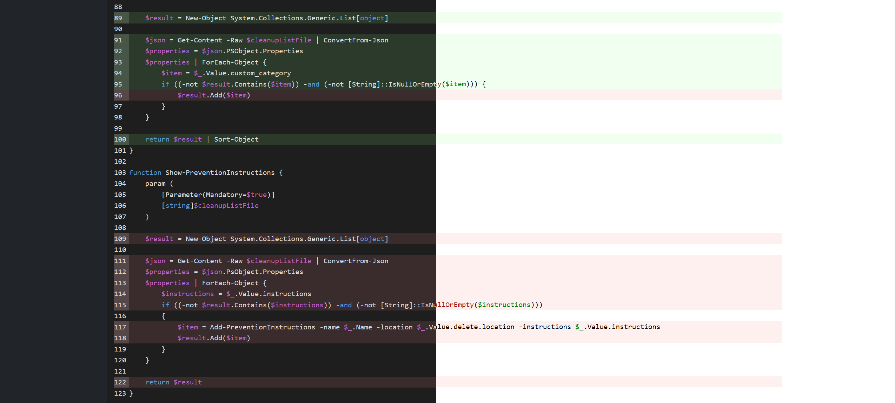

= JaCoCo XML to HTML in PowerShell
:toc:
:toclevels:

== Support this tool

link:https://ko-fi.com/E1E3VQUK2[image:https://ko-fi.com/img/githubbutton_sm.svg[Ko-fi]]

== Description

JaCoCo (Java Code Coverage) XML to HTML converter written in PowerShell.

JaCoCo is a popular code coverage format used by several languages and tools, including PowerShell's Pester testing
framework.

The best thing about this tool is - it's all PowerShell. You don't need to have Java or any other tool installed in
order to generate an HTML report.

== Showcase

=== Key features

* Pure PowerShell without dependencies
* Code coverage statistics per group, package and source file
* Source code coverage with colored lines, automatic source code language detection and syntax highlighting
* All supported statistics are covered: instructions, branches, lines, complexity, methods and classes
* Dark and light themes
* Support for custom themes (Bootstrap or your own custom CSS)
* Simple, but rich, well documented configuration (config file) with minimum mandatory fields - exactly 3: XML file,
source code directory and HTML destination directory. The rest are pure customization options.
* Easy integration with Pester
* Mozilla Public License 2.0 (free and open source)

== Installation

=== Prerequisites

* Microsoft PowerShell 7 (link:https://learn.microsoft.com/en-us/powershell/scripting/install/installing-powershell-on-windows[Installation instructions])
* For running Pester tests see the link:doc/testing.adoc[Testing guide]

=== Installation

Clone the repository:

[source,shell]
----
git clone https://github.com/constup/JaCoCo-XML-to-HTML-PowerShell .
----

or download and unpack a release from link:https://github.com/constup/JaCoCo-XML-to-HTML-PowerShell/releases[Releases page]

== How to use

=== Configuration

In order to use this tool, you will need a configuration file. A commented-out configuration file
(link:config.ps1.dist[config.ps1.dist]) is provided, so you can just copy it to your project and run JaCoCo-XML-To-HTML.
Just remember to remove the `.dist` extension.

Mandatory configuration options are:

* `xml_file`: the coverage report XML file;
* `destination_directory`: where you want to save the HTML report. This directory must be empty. The directory will be
created if it does not exist;
* `sources_directory`: root directory where your project's source code is (usually `src/` directory in your project)

The rest of the configuration options are optional. Their description and documentation is available on the
link:doc/configuration.adoc[Configuration] page.

=== Running

Once you have a configuration file with mandatory properties filled, everything is done by calling one command:

[source,shell]
----
pwsh .\constup-jacoco-xml-to-html.ps1 --config /path/to/your/configuration/file
----

=== Themes and customization

By default, JaCoCo XML to HTML will create an HTML with a light theme. To generate a report with a dark theme, set the
theme in your configuration file:

[source,powershell]
----
'theme' = 'dark';
----

More theme and customization options are available on the link:doc/configuration.adoc[Configuration] page.

== More documentation

The following documentation is also available:

* link:doc/configuration.adoc[Configuration] - Additional configuration, themes and customization options
* link:doc/test-tools-integration.adoc[Test Tools Integration] - How to integrate this tool with testing tools
* link:doc/testing.adoc[Testing] - Unit testing with Pester

== 3rd party software licenses

This project uses and is bundled with the following 3rd party software:

* link:https://getbootstrap.com[Bootstrap v5.3] - Copyright (c) 2011-2025 The Bootstrap Authors
** link:https://github.com/twbs/bootstrap/blob/main/LICENSE[MIT License] (official repository)
** link:assets/bootstrap/LICENSE[MIT License] (bundled with this project)
* link:https://highlightjs.org[HighlightJS v11.11] - Copyright (c) 2006, Ivan Sagalaev
** link:https://github.com/highlightjs/highlight.js/blob/main/LICENSE[BSD 3-Clause License] (official repository)
** link:assets/highlightjs/LICENSE[BSD 3-Clause License] (bundled with this project)
* link:https://github.com/wcoder/highlightjs-line-numbers.js[HighlightJS Line Numbers plugin v2.9] - Copyright (c) 2017 Yauheni Pakala
** link:https://github.com/wcoder/highlightjs-line-numbers.js/blob/master/LICENSE[MIT License] (official repository)
** link:assets/highlightjs/LICENSE[MIT License] (bundled with this project)

== Support

If you like this tool or find it useful, consider buying me a nice cup of coffee. Coffee fuels open source.

link:https://ko-fi.com/E1E3VQUK2[image:https://ko-fi.com/img/githubbutton_sm.svg[Ko-fi]]

== License

link:LICENSE[Mozilla Public License 2.0] (also available on Mozilla's website at:
https://www.mozilla.org/en-US/MPL/2.0/[MPL 2.0])